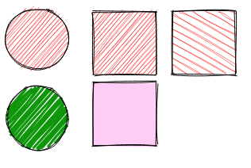
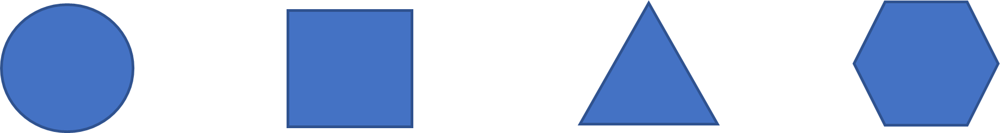
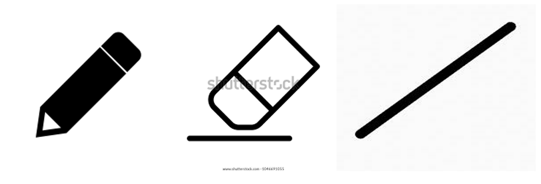
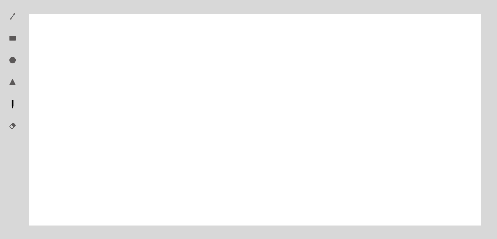

# paint-app
 I am using npx(Node Package eXecute) instead of npm as it is faster and executes any package that you want from the npm registry without even installing that package.
 [Rough.js](https://roughjs.com/) is a light javascript library that will make the lines and shapes in a *hand-drawn-like* style.



Execute the following commands in the terminal:

```
npx create-react-app paint-app 
cd paint-app
npm install --save roughjs
npm install bootstrap
npm install reactcss
```
Our next step is to create a folder named “components” in folder src. Here all the components being rendered will be created.

### Adding canvas API to the project
The canvas element along with JavaScript lets us use the [canvas API](https://developer.mozilla.org/en-US/docs/Web/API/Canvas_API) It has many functionalities and supports animations but sticking to this application we are using features to draw shapes.

We are going to draw four shapes : Circle , Square , Triangle , Hexagon.

And a Pencil ,Rubber and Line.

### Wireframe of the Paint App



